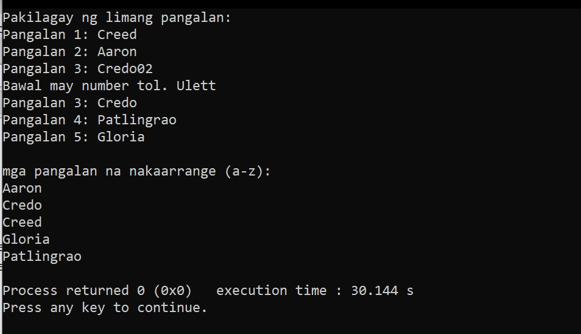

# Helping a Friend (using bubble sort in C)

This is a mini program in c I made during vacation to help a friend practice basic programming concepts. It also serves as my personal review of past lessons such as string handling, functions, loops, and specially bubble sort.

---

## The program:
1. Accepts five names from the user.
2. Validates that each name contains no numbers.
3. Sorts the names alphabetically (a–z) using Bubble Sort.
4. Displays the sorted list.

---

## Code Overview

### Functions
- `int checkname(char pangalan[])`  
  Checks if the name contains any numeric digits. Returns:
  - `1` if invalid (contains numbers)
  - `0` if valid

- `void sortNames(char names[5][100])`  
  Sorts the array of names alphabetically using **Bubble Sort**.

---

## Sample Run

---

